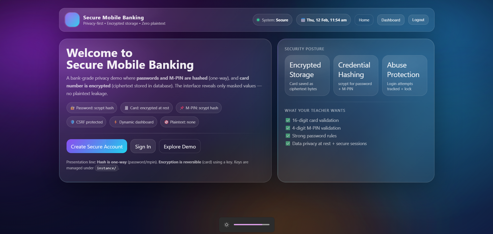
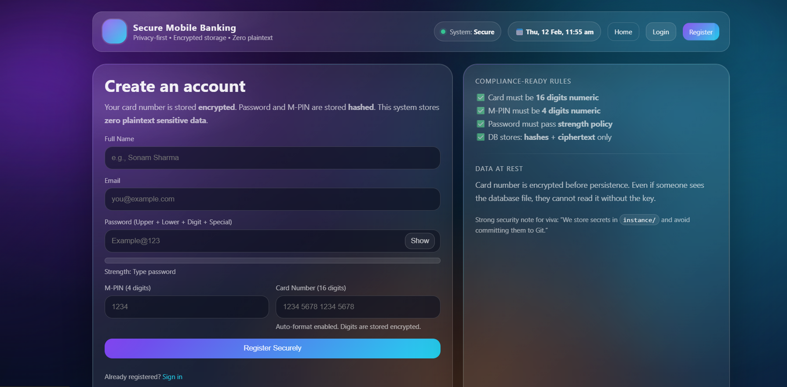
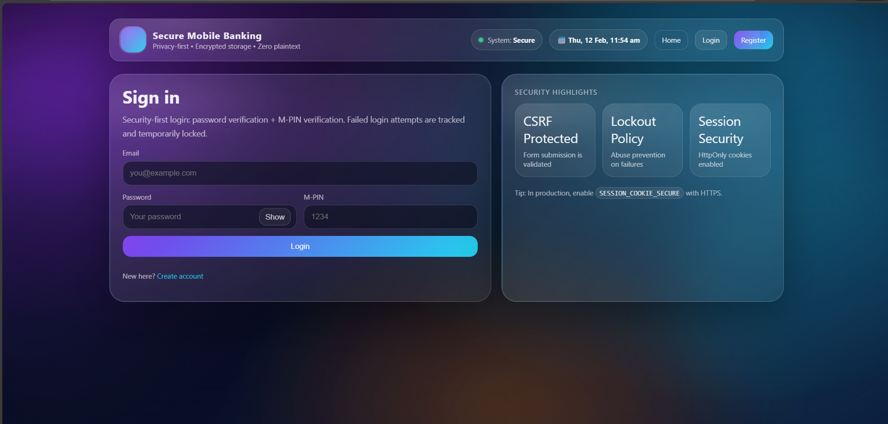
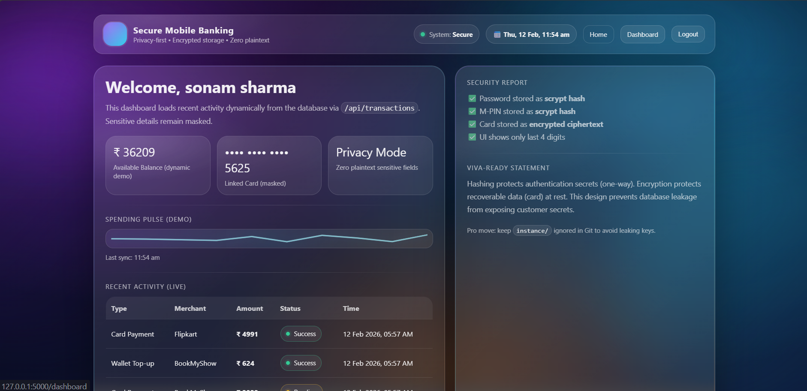

<p align="center">
  <h1 align="center">🔐 Secure Mobile Banking System</h1>
  <p align="center">
    Ultra Dynamic • Privacy First • Encrypted Banking Web App
  </p>
</p>

<p align="center">
  
  
  
  
</p>

---

# 🚀 Project Overview

A production-style secure mobile banking simulation system demonstrating real-world backend security principles and modern animated UI engineering.

This system ensures:

- 🔐 No plaintext credential storage
- 💳 Encrypted card data at rest
- 🔑 Secure password hashing
- 🚫 Login abuse protection
- 🎨 Ultra dynamic animated background
- 📊 Interactive dashboard

---

# 🛡 Security Architecture

## 🔑 Hashing (One-Way)

- Password → `scrypt`
- M-PIN → `scrypt`
- Non-reversible hashing
- Strong password enforcement

## 💳 Encryption (Reversible)

- Card number → Encrypted using `Fernet`
- Stored as ciphertext in DB
- Only last 4 digits displayed

## 🚦 Login Protection

- Failed login attempts tracked
- Account temporarily locked after multiple failures
- Secure session handling

## 🔐 CSRF Protection

- All forms protected with session-based CSRF tokens

---

# 🧠 System Architecture

Frontend (HTML/CSS/JS)
│
▼
Flask Routes (app.py)
│
▼
Security Layer (security.py)
│
├── Hash Password / M-PIN
└── Encrypt Card Number
│
▼
Database (SQLite via SQLAlchemy)


---

# 🎨 UI Features

- Real-time animated background
- Color cycling gradient engine
- Glassmorphism layout
- Password strength meter
- Live dashboard transactions
- Dynamic JSON API rendering
- Auto card formatting

---
# 📂 Project Structure

```base
secure-mobile-banking/
│
├── app.py # Main Flask application
├── models.py # Database models
├── security.py # Encryption & hashing logic
├── requirements.txt
│
├── instance/ # Secret keys (ignored in Git)
│
├── static/
│ ├── style.css # Animated UI engine
│ └── app.js # Dynamic interactions
│
└── templates/
├── base.html
├── index.html
├── register.html
├── login.html
└── dashboard.html
```
# 📸 Application Screenshots

## 🏠 Home Page


## 📝 Registration Page


## 🔐 Login Page


## 📊 Dashboard


---


